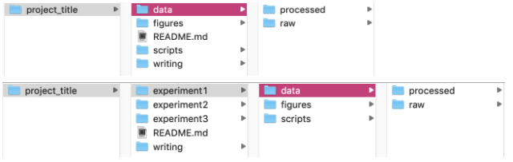

These best practices are just a few of the important organizarion tips and tricks for reproducible research. If you have more ideas, contact Rimjhim!

### General

* You should be doing most (if not all) of your analyses on IBU data and project directories (not your home directory)
	* It is important to make sure the code is backed up/saved with version history on ParisodLab github to allow other lab members to access your code/scripts when necessary. This needs an efficient organization of your data and scripts for each project.
* Do **NOT** use spaces in names of files or folders. Try not to use spaces in column names too (although sometimes it is necessary for a final table output)
	* Computers often have a hard time reading spaces and code used to ignore spaces can vary from program to program
	* Instead, you can use `_` or `.` or `-` or capitalization (`fileName.txt`)
* **NEVER** replace raw data!!!!!
	* You should save your raw data in the rawest format, and submitted to ENA as soon as possible and backed up on BigData untill publication. Write a script to analyze it, then if you wish, save the processed data for further use. This is important because it always allows you to go back to the original raw data in case something happens
	* Some suggested project folder structure might look like something below:

* Include a `README.md` (or `README.txt`) file in each project folder to explain where the data and scripts can be found for certain analyses. Trust me, after a few years you will definitely forget…
	* And don’t forget to update the `README` regularly, an old `README` doesn’t do anyone good!
* Either use full path names in scripts or be explicit about where the working directory is
	* This is important to allow other people to run your code (or might even be helpful for you if you ever reorganize folders one day)
* As much as possible, ensure that your processed data is “tidy” (see below). This doesn’t work for all complex data types, but it should be a general norm to follow.
	* Each variable must have its own column
	* Each observation must have its own row
	* Each value must have its own cell
	* No color or highlighting 
	* No empty cells (fill with `NA` if necessary)
	* Save data as plain text files (`.csv`, `.tsv`, `.txt` etc. -- NOT `.xls`!!!)
* **Never** open a file in Excel and save it as an excel file. Excel has a habit of changing the data in the file without you knowing it. Instead, use a text editor or a program like R or Python to save the file as a `.csv`

### R

* **ALWAYS** use namespaces before functions from packages (i.e. `dplyr::filter()` instead of `filter()`)
	* This includes `ggplot2` and especially `dplyr`!!!
	* Some packages have functions with the same name, so adding a namespace is crucial for reproducibility.
	* Also, this helps other people read your code by knowing which functions came from which packages
* When piping with Tidyverse (`%>%`), press `<Enter>` to go to the next line after a pipe
	* This makes your code more readable 
	* In fact, general practices state no more than 80-100 characters per line of code EVER to increase readability

### IBU

* You should be doing most (if not all) of your analyses in `/data/projects/<project_name>/<user_id>` or `/data/users/<user_id>` (not your home directory (i.e. `/home/<user_id>`))

!!! Important
	Main exception: Snakemake and Nextflow temporary working directories should NOT be on `/data` (it will fill us up!) but rather in the scratch space which can be accessed with the variable $SCRATCH on IBU. It assigns a temporary scratch directory for each job that is run.
	

### Python

[ Needs filling in from someone who uses python :) ]
