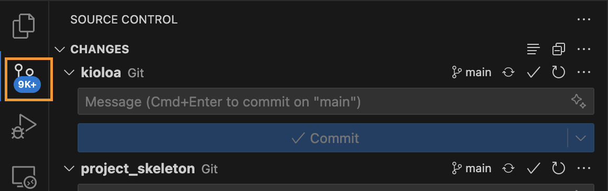

# Source Control with Git and VSCode

[TOC]

## Introduction

[Git](https://git-scm.com/) is a version control software package similar to traccked changes and saving documents as "final1.pdf" and "final2.pdf"


[Github](https://github.com/) is a 3rd party web-based graphical interface that has a copy of the project that you and/or other people can push and pull from to work on the same code simultaneously. Keep in mind, its not like google docs, it doesn’t update automatically, requires you to push changes and pull changes to the new computer.


!!! Note
	You must install `git` to use and create an account on Github. Check out this intro guide [here](https://docs.gitlab.com/ee/gitlab-basics/start-using-git.html)

## Using Git and Github

The Parisod Lab Github can be found [here](https://github.com/parisodlab). As of the writing of this page, we have 165 "repositories" (or projects). Notice some projects are workflow like `snakeGATK4_v2` and others are shared projects (`codeclub`) or manuscripts (`mbe_manuscript_2024`). Anything can be a repo!

There are two main ways to use Git: on the command line (aka Terminal on Macs) or with a GUI (graphical user interface). Both are good and neither are "wrong". For new users, it is usually easier to start with a GUI like the Source control extension in VSCode. However, only a few basic commands are really necessary to get started using git on the command line, so don't be nervous!

!!! Important
	When you are working on a collaborative project with multiple people, you should always be working in a branch. This is a copy of the project that you can make changes to without affecting the main project. 

## The GitHub Flow

There are several different Git branching strategies, but the most popular for our lab is the "GitHub Flow". This 8 step process can help keep our pipelines flowing, functional, and organized. 


The following 8 steps can be done on the command line or with a GUI. Below I will show the basic `git` commands for managing a repo on the command line.

!!! Note
	When you are maintaining a project repo that only you are updating, it is *less important* to follow the GitHub Flow with creating short-lived branches. However, if you are developing/maintaining code that other people will use and/or working collaboratively this is an **essential** skill to master. 

### 1. Clone/pull

```

# Cloning - new repo
cd < directory you want repo stored >
https://github.com/parisodlab/snakeGATK4_v2
cd snakeGATK4_v2

# pulling - already cloned repo you want to get newest version of
cd < directory of repo >
git pull

```

### 2. Branch

```

# create a new branch AND move to it
git checkout -b <branch_name>

# list all available branches
git branch

# move to a branch
git checkout < name of branch >

```

### 3. Edit

No code here... make any edits to the repo.

### 4. Commit

```

# first step - add changed files to staging area
git add <changed file>

# OR add ALL files to staging area
git add .

# commit files in staging area
git commit -m "<some message about what changes you made>"

```

### 5. Push

```

# push changes to remote
git push

# when it is your first time pushing a new branch, it might prompt you to set an upstream branch:
git push --set-upstream origin new_branch

```

### 6. Pull request

I generally like to do this step online at github.com because I think it is useful to visually see the changes I made

- go to the repo site
- click the green "compare and pull request" button
- check the branches are right at the top: which branch is merging into which branch
- optional: assing reviewer and/or assignees on the right hand side. This is often useful when coding collaboratively 
- update the title/comment for the pull request to let yourself and others know what changes were made and why


### 7. Inspect

I generally like to do this step online at github.com because I think it is useful to visually see the changes I made. If you scroll down you should be able to see which files were changed and what exact changes were made. If there are merge conflicts, github will walk you through fixing them.

### 8. Merge

When you are satisfied with your merge, click the green "merge pull request" button. Also make sure the delete the old branch when you are done as part of keeping the repo clean and clutter-free

!!! Note
	Good practice is to make a new branch to implement a new feature, then delete the branch once it has been merged. To start a new feature, open a NEW branch. Not as important on self-projects, but very important for collaboration

## Command Line `git` commands

__Basic__

* `git clone` - clone remote repository
* `git pull` - pull most recent version from remote
* `git add` - add local files to be staged for remote
* `git commit` - stage/commit local changes
* `git push` - push local commits to remote

__Intermediate__

* `git branch` - list all available branches
* `git checkout` - move to new branch
* `git status` - checks which branch you are on and if you have any unsaved changes
* `git log` - shows log of previous commits on current branch
* `git diff` - shows details of changes made

*For more, check out [this](https://docs.gitlab.com/ee/gitlab-basics/start-using-git.html) tutorial, and others.*

## GitHub Flow Best Practices

* Any code in the main branch should be deployable
* Create new descriptively-named branches off the main branch for new work such as feature/add-new-plot
* Commit new work to your local branches and regularly push work to the remote
* To request feedback or help, or when you think your work is ready to merge into the main branch, open a pull request
* After your work or feature has been reviewed and approved, it can be merged into the main branch
* Delete stale branches!
* Once your work has been merged into the main branch, it should be deployed immediately

!!! Note
	GitHub Flow is not the only branching strategy out there! [This](https://www.gitkraken.com/learn/git/best-practices/git-branch-strategy#github-flow-branch-strategy) was a great article about the three most common strategies with pros and cons for why you might use each one. I challenge you to think aobut which strategy might be best for our lab moving forward and let's start a discussion about it!


## Using Git with VSCode

VSCode has a built-in source control extension that makes it easy to use git commands without the command line. This is a great way to get started with git and learn the basics of version control.

1. Open the source control tab on the left side of the screen



2. Click the "+" to stage changes


3. Add a commit message and click the checkmark to commit changes


4. Click the three dots to push changes to the remote repository


5. Click the three dots to pull changes from the remote repository


6. Click the three dots to create a new branch


# Resources

* [This](https://www.edureka.co/blog/git-vs-github/) blog on the differences between `git` and `github`
* "Git started" using `Git` on the command line [here](https://docs.gitlab.com/ee/gitlab-basics/start-using-git.html)
* Overview of top Git GUI from 2021 [here](https://acodez.in/git-gui-clients/)
* Great [intro video](https://www.youtube.com/watch?v=PBI2Rz-ZOxU) to the GitHub Flow
* **HIGHLY RECOMMENDED** [introduction tutorial](https://lab.github.com/githubtraining/introduction-to-github) to GitHub Flow
* Amazing article on different git branch strategies [here](https://www.gitkraken.com/learn/git/best-practices/git-branch-strategy#github-flow-branch-strategy)
