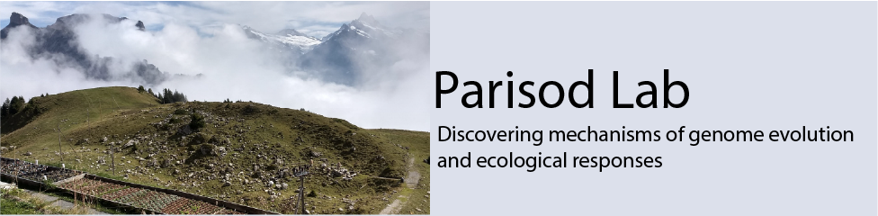

# Welcome to the Parisod Lab Dry Guide

The Dry Guide details the computational infrastructure and tasks used in the Parisod Lab. Looking for more resources? Check out our Parisod Lab [code club](https://github.com/parisodlab/code_club) GitHub repo for more coding tips and tricks!

### Other links:
* [Parisod Lab website](https://www.unifr.ch/bio/en/research/genetics/parisod-group.html)
* 

